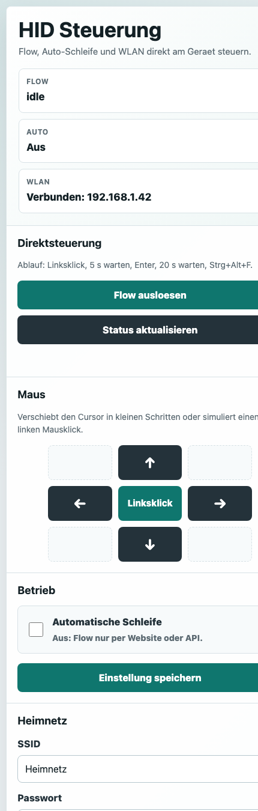

# HID Steuerung

ESP32-S3/Arduino-Sketch fuer eine USB-HID Maus- und Tastatursteuerung mit lokaler Weboberflaeche, eigenem WLAN-Access-Point und optionaler Heimnetz-Integration.



## Funktionen

- USB-HID Maus und Tastatur
- Eigener Setup-Access-Point: `HID-Setup`
- Optionaler Beitritt zum Heimnetz ueber die Weboberflaeche
- Lokale, mobilfreundliche Website ohne externe JS-/CSS-Abhaengigkeiten
- Flow per Website oder API ausloesen
- Automatische Schleife ein- und ausschaltbar
- Geplante Einmal-Auslösungen zu festen Zeitpunkten (persistent gespeichert)
- Zeitsynchronisation per NTP beim Start (Zeitzone Mitteleuropa, inkl. Sommerzeit)
- Live-Statusanzeige mit Gerätezeit, Flow-Zustand und Countdown zur nächsten Auslösung
- Manuelle Maussteuerung per Pfeiltasten auf der Website
- Manueller Linksklick per Website oder API
- Bildschirm-Wachhalten auch im Leerlauf (Maus wackelt alle 10 s leicht)

## Ablauf

Beim Einstecken:

1. USB-HID wird initialisiert.
2. Die Maus faehrt ein sichtbares ca. 5 x 5 cm Rechteck ab.
3. Danach startet die Websteuerung und der Sketch ist bereit.

Der Flow macht:

1. Linksklick
2. 5 Sekunden warten
3. Enter druecken
4. 20 Sekunden warten
5. `Strg + Alt + F`

Wenn die automatische Schleife aktiv ist, wartet der Sketch nach jedem Flow zufaellig 25 bis 35 Minuten und startet dann erneut. Im Standby bewegt sich die Maus regelmaessig ca. 1 cm nach links und wieder zurueck, damit sichtbar ist, dass der Sketch noch laeuft.

Auch im Leerlauf (Automatik aus) wackelt die Maus alle 10 Sekunden leicht hin und her, damit der Bildschirm nicht in den Energiesparmodus wechselt.

## Geplante Auslösung

Auf der Website lassen sich unter „Geplante Auslösung" feste Zeitpunkte festlegen, an denen der Flow einmalig automatisch startet (bis zu 8 Einträge). Voraussetzung ist eine synchronisierte Gerätezeit – diese wird beim Start per NTP geholt, sobald eine Heimnetz-Verbindung besteht. Die Zeitpunkte werden persistent gespeichert und nach einer Auslösung automatisch entfernt. Verpasste Zeitpunkte (z. B. weil das Geraet aus war) werden bis zu eine Stunde spaeter nachgeholt, danach verfallen sie.

## Weboberflaeche

Nach dem Flashen verbindet man sich mit dem Access-Point:

- SSID: `HID-Setup`
- Passwort: `hidsetup123`
- URL: `http://192.168.4.1/`

Auf der Website kann man:

- den Flow ausloesen
- die automatische Schleife aktivieren/deaktivieren
- WLAN-Zugangsdaten fuer das Heimnetz speichern
- die Maus mit Pfeiltasten verschieben
- einen Linksklick senden

Der Access-Point bleibt aktiv, auch wenn das Geraet zusaetzlich im Heimnetz verbunden ist.

## API

Status lesen:

```http
GET /api/status
```

Flow ausloesen:

```http
POST /api/trigger
```

Maus bewegen:

```http
POST /api/mouse?dx=20&dy=0
```

Linksklick senden:

```http
POST /api/click
```

Automatische Schleife einschalten:

```http
POST /api/settings?auto=1
```

Automatische Schleife ausschalten:

```http
POST /api/settings?auto=0
```

Geplante Auslösung hinzufügen (lokale Gerätezeit, Format `YYYY-MM-DDTHH:MM`):

```http
POST /api/schedule?when=2026-06-01T14:30
```

Geplante Auslösung löschen (Epoch-Zeit wie in `/api/status` geliefert):

```http
POST /api/schedule/delete?when=1780000000
```

Das Statusobjekt aus `GET /api/status` enthaelt zusaetzlich `time` (Epoch), `timeSynced`, `maxSchedules` und die Liste `schedules` mit `when` und `label`.

## Wichtige Hinweise

- Das Board muss nativen USB-HID-Betrieb unterstuetzen, z. B. ESP32-S3 mit aktivem TinyUSB/USB-OTG-Modus.
- Der richtige native USB-Port muss verwendet werden. Ein reiner UART/Serial-Bridge-Port sendet keine HID-Eingaben.
- Nach dem Flashen das Board einmal abstecken und wieder anstecken, damit der Rechner die HID-Descriptors neu erkennt.
- Zentimeter-Angaben fuer Mausbewegungen sind Naeherungen. Betriebssystem, Bildschirmaufloesung und Mausbeschleunigung koennen die sichtbare Distanz veraendern.

## Build

Dieses Repository enthaelt aktuell nur den Arduino-Sketch unter `sketch/sketch.ino`. Eine `platformio.ini` oder Arduino-CLI-Projektkonfiguration ist nicht enthalten.
